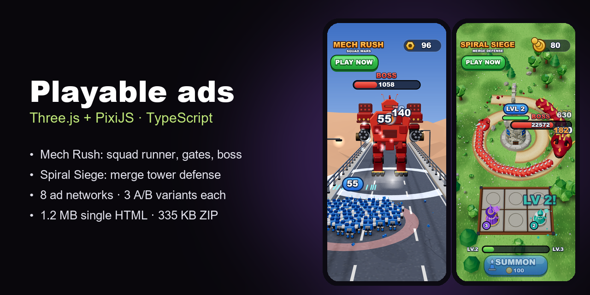

AI engineer in Kazakhstan (UTC+5). I build LLM pipelines with automated quality checks and run them in production: generative video, multimodal LLM-as-judge, RAG over code. I also build playable ads in TypeScript. MSc from MIPT, PhD candidate in computer vision.

- [playable-ads](https://github.com/de4er00/playable-ads): two playable ads, a squad runner and a merge tower defense, on Three.js and PixiJS, with every mesh, texture and sound generated in code. One code base builds 3 A/B variants for 8 ad networks, each tested against that network's SDK stub. [Play them in the browser](https://de4er00.github.io/playable-ads/)
- [code-rag-mcp](https://github.com/de4er00/code-rag-mcp): local hybrid code search for coding agents, measured on 70 questions with held-out sets
- [narration-pipeline](https://github.com/de4er00/narration-pipeline): writes narration for explainer videos with fact statuses and about 25 deterministic checks, then cuts it into frames with an exact dynamic program
- [procedural-films](https://github.com/de4er00/procedural-films): short films where every frame and sound is computed in plain JavaScript and Canvas

Open to remote roles. laido59@gmail.com · t.me/deselection
